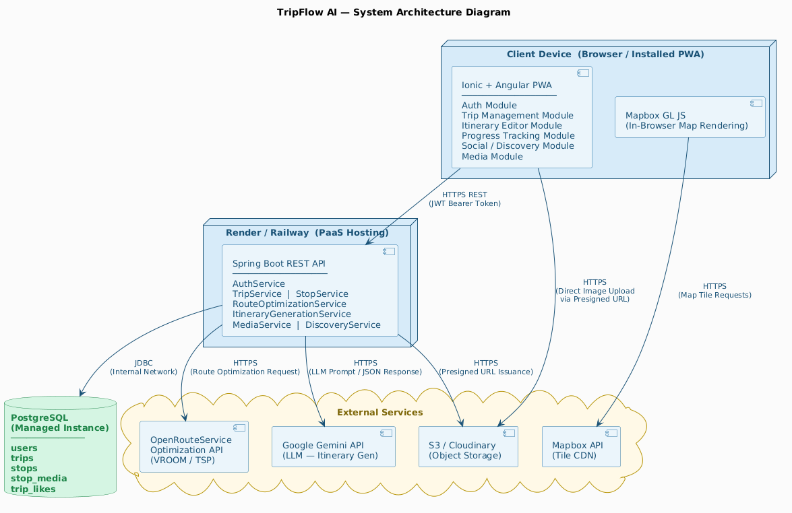
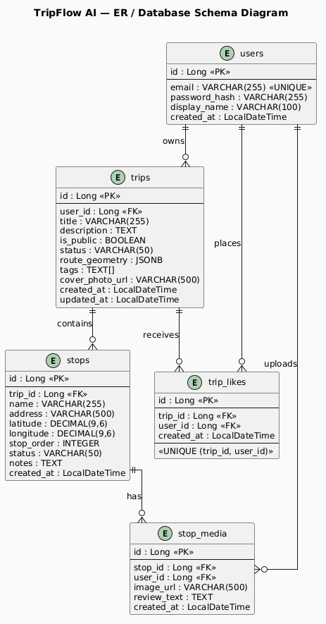
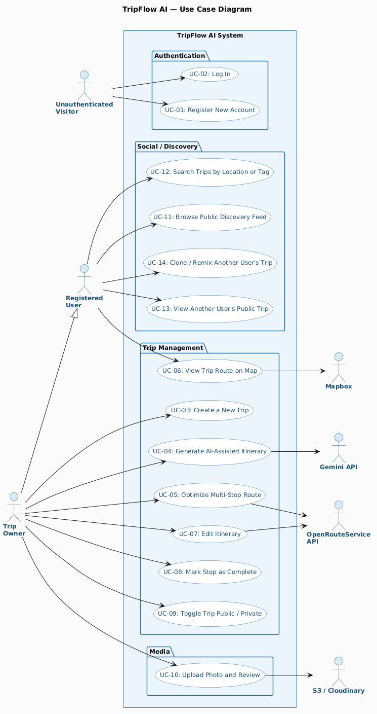

# TripFlowAI
AI-powered multi-stop trip planning PWA. Built with Ionic + Angular, Spring Boot, PostgreSQL, Mapbox, and the Gemini API.

## Project Structure
TripFlowAI/

├── backend/          # Spring Boot 4.1 (Java 21)

├── frontend/         # Ionic + Angular PWA (TypeScript)

├── docs/             # Project documentation and diagrams

├── .github/workflows # GitHub Actions CI/CD

└── README.md

## Architecture at a glance

Layered Spring Boot 4.1 / Java 21 backend, PostgreSQL + Flyway, Ionic/Angular 20 PWA frontend.

## Data model

## Key user flows

Detailed sequence diagrams: 
[SD1](docs/diagrams/SD1.png) 
[SD2](docs/diagrams/SD2.png)
[SD3](docs/diagrams/SD3.png)
[SD4](docs/diagrams/SD4.png)
[SD5](docs/diagrams/SD5.png)

## Architecture rationale
- Layered (`controller/service/repository/domain/dto/mapper/security/config/client/`) over feature-slice: 4 devs, ~5k LoC, Spring Boot conventions every grader recognizes.
- `client/{ors,gemini,cloudinary}/` pattern for external integrations: wire-format DTOs separate from domain DTOs, `@ConfigurationProperties` per client, per-client timeouts, translated exceptions (`OrsClientException` → 502).
- JWT + `UserPrincipal implements UserDetails` — real Spring Security principal, not string parsing.
- Testcontainers CI-only via `-Pci` Maven profile — none of the team's machines run Docker.

## Key decisions
- **Testcontainers as CI-only.** No local Docker on any team machine; scoped `*IT.java` to Failsafe under `-Pci` so local `mvn verify` never fails on missing Docker.
- **Partial unique index for Place dedup.** `places (external_place_id) WHERE external_place_id IS NOT NULL` — permits legacy manual-entry places while enforcing dedup for map-picker inputs.
- **Records + component mappers over MapStruct.** Boot 4.1's records support + Spring's DI covers 100% of our mapping needs without an annotation processor in the toolchain.
- **`ddl-auto=validate` in every profile.** Enforces Flyway as the single source of truth after schema drift bit us early.

## What we'd do differently
- Adopt CI (GitHub Actions) in week 1, not week 3 — three sprints without coverage numbers cost us visibility on regressions.
- Typed JWT config (`@ConfigurationProperties("jwt")` with `Duration` types) from day one — string-parsing durations bit twice.
- Formalize Definition of Ready / Done in Sprint 1, not Sprint 3.

## Documentation
- [Software Development Plan (SDP)](docs/SDP/SDP.md)
- [Deployment runbook](docs/deployment.md)

## Tech Stack

- **Frontend:** Ionic + Angular (PWA)
- **Backend:** Spring Boot 4.1 (Java 21)
- **Database:** PostgreSQL
- **Maps:** Mapbox GL JS
- **Route Optimization:** OpenRouteService
- **AI:** Google Gemini API
- **Auth:** Spring Security + JWT + BCrypt
- **Image Storage:** Cloudinary
- **CI/CD:** GitHub Actions

## Team

| Name | Role |
|------|------|
| Tanish Aggarwal | Lead Developer |
| Neel Solanki | Frontend / UI-UX |
| Pratham Doshi | Database & API Integration |
| Joann Monteiro | QA & Version Control |

**Supervisor:** Syed Raza Bashir, Sheridan College.

## Branch Strategy

- `main` — protected, always deployable
- `feature/<Jira-Key><name>` — new features
- `fix/<Jira-Key><name>` — bug fixes
- All merges require a PR with at least 1 reviewer

## Deployment

**Health check:** `GET /actuator/health` — no authentication required, returns `{"status":"UP"}` when the app and its dependencies are healthy. Configure this as the health check path in Render (or any platform requiring a deploy-verification probe).

Only the `health` endpoint is exposed (`management.endpoints.web.exposure.include=health` in `application.properties`) — all other actuator endpoints (`env`, `beans`, `heapdump`, etc.) are intentionally never exposed.